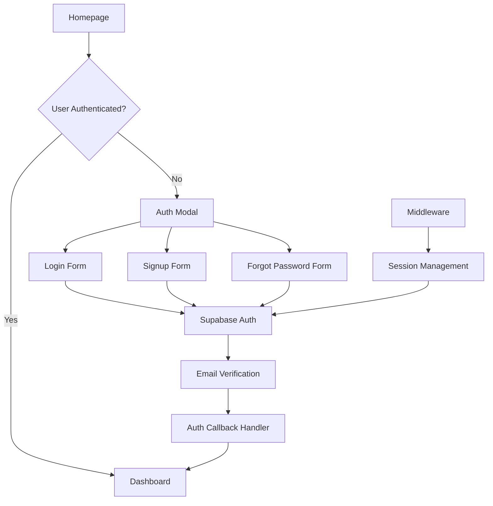

# Design Document

## Overview

This document outlines the design for implementing a comprehensive Supabase authentication system in the Next.js CRM application. The system will provide secure user authentication using email/password credentials, user registration, and password recovery functionality through a modal-based interface and dedicated pages.

The design leverages the modern `@supabase/ssr` package for server-side authentication, ensuring seamless integration with Next.js App Router architecture while maintaining security best practices.

## Architecture

### High-Level Architecture



### Component Architecture

The authentication system follows a modular component-based architecture:

1. **Client Components**: Handle user interactions and form submissions
2. **Server Components**: Manage authentication state and protected routes
3. **Middleware**: Handles session refresh and route protection
4. **Utility Functions**: Provide Supabase client instances for different contexts

## Components and Interfaces

### Core Components

#### 1. Auth Modal Component
- **Location**: `components/auth/auth-modal.tsx` (already exists, to be extended)
- **Purpose**: Responsive modal/drawer for login, signup, and password reset
- **Features**:
  - Responsive design (modal on desktop, drawer on mobile)
  - Tabbed interface for login/signup with forgot password link
  - Additional forgot password view within the modal
  - Form validation and error handling
  - Integration with Supabase authentication

#### 2. Homepage Button Component
- **Location**: `app/page.tsx` (to be modified)
- **Purpose**: Conditional button based on authentication state
- **States**:
  - Unauthenticated: "Login / Sign Up" → Opens Auth Modal
  - Authenticated: "Go to Dashboard" → Navigates to dashboard

#### 3. Password Reset Components
- **Location**: Extended within `components/auth/auth-modal.tsx`
- **Purpose**: Forgot password functionality within the auth modal
- **Features**:
  - Additional tab/view for password reset
  - Email input form
  - Password reset request handling
  - Success/error messaging within modal

#### 4. Auth Callback Handler
- **Location**: `app/auth/callback/route.ts` (new)
- **Purpose**: Handle email verification and password reset callbacks
- **Functionality**:
  - Token hash verification
  - Session establishment
  - Redirect handling

### Utility Components

#### 1. Supabase Client Utilities
- **Client-side**: `utils/supabase/client.ts`
- **Server-side**: `utils/supabase/server.ts`
- **Middleware**: `utils/supabase/middleware.ts`

#### 2. Authentication Context
- **Purpose**: Provide authentication state throughout the application
- **Implementation**: Server-side session management with middleware

## Data Models

### User Authentication Flow

```typescript
interface AuthUser {
  id: string
  email: string
  email_confirmed_at?: string
  created_at: string
  updated_at: string
}

interface AuthSession {
  access_token: string
  refresh_token: string
  expires_at: number
  user: AuthUser
}

interface AuthError {
  message: string
  status?: number
}
```

### Form Data Models

```typescript
interface LoginFormData {
  email: string
  password: string
}

interface SignupFormData {
  name: string
  email: string
  password: string
}

interface PasswordResetFormData {
  email: string
}

interface NewPasswordFormData {
  password: string
  confirmPassword: string
}
```

## Error Handling

### Error Categories

1. **Validation Errors**
   - Invalid email format
   - Weak password
   - Missing required fields

2. **Authentication Errors**
   - Invalid credentials
   - User not found
   - Account not verified

3. **Network Errors**
   - Connection timeout
   - Server unavailable
   - Rate limiting

### Error Display Strategy

- **Modal Forms**: Display errors inline within the modal
- **Password Reset**: Show errors on the dedicated page
- **Global Errors**: Use toast notifications for system-level errors

### Error Recovery

- Automatic retry for network errors
- Clear error messages with actionable guidance
- Graceful fallbacks for authentication failures

## Testing Strategy

### Unit Testing

1. **Component Testing**
   - Auth modal form validation
   - Button state changes
   - Error message display

2. **Utility Function Testing**
   - Supabase client creation
   - Session management
   - Token validation

### Integration Testing

1. **Authentication Flow Testing**
   - Complete signup process
   - Login with valid/invalid credentials
   - Password reset flow
   - Email verification

2. **Route Protection Testing**
   - Unauthenticated access attempts
   - Authenticated user navigation
   - Session expiration handling

### End-to-End Testing

1. **User Journey Testing**
   - New user registration
   - Existing user login
   - Password recovery within modal
   - Session persistence

2. **Cross-Browser Testing**
   - Modal/drawer responsiveness
   - Tab/view switching within modal
   - Authentication state consistency
   - Cookie handling

## Security Considerations

### Authentication Security

1. **Password Requirements**
   - Minimum 8 characters
   - Client-side validation
   - Server-side enforcement via Supabase

2. **Session Management**
   - Secure HTTP-only cookies
   - Automatic token refresh
   - Proper session cleanup on logout

3. **CSRF Protection**
   - SameSite cookie attributes
   - Origin validation
   - PKCE flow implementation

### Data Protection

1. **Sensitive Data Handling**
   - No password storage in client state
   - Secure token transmission
   - Proper error message sanitization

2. **Route Protection**
   - Middleware-based authentication checks
   - Server-side user validation
   - Redirect handling for unauthorized access

## Implementation Details

### Environment Configuration

```bash
# Required environment variables
NEXT_PUBLIC_SUPABASE_URL=your-supabase-url
NEXT_PUBLIC_SUPABASE_ANON_KEY=your-supabase-anon-key
```

### Middleware Configuration

```typescript
// middleware.ts
export const config = {
  matcher: [
    '/((?!_next/static|_next/image|favicon.ico|.*\\.(?:svg|png|jpg|jpeg|gif|webp)$).*)',
  ],
}
```

### Email Template Configuration

- **Signup Confirmation**: `{{ .SiteURL }}/auth/callback?token_hash={{ .TokenHash }}&type=email`
- **Password Recovery**: `{{ .SiteURL }}/auth/callback?token_hash={{ .TokenHash }}&type=recovery`

## Dependencies

### Required Packages

```json
{
  "@supabase/ssr": "^0.5.1",
  "@supabase/supabase-js": "^2.45.4"
}
```

### Existing Dependencies (Already Available)

- Next.js 16.0.0
- React 19.2.0
- TypeScript 5
- Radix UI components
- Tailwind CSS

## Performance Considerations

### Client-Side Optimization

1. **Component Lazy Loading**
   - Auth modal loaded on demand
   - Efficient modal state management

2. **State Management**
   - Minimal client-side auth state
   - Server-side session validation
   - Modal view state management

### Server-Side Optimization

1. **Middleware Efficiency**
   - Selective route matching
   - Efficient session refresh logic

2. **Database Queries**
   - Optimized user lookups
   - Proper indexing on email fields

## Accessibility

### WCAG Compliance

1. **Form Accessibility**
   - Proper label associations
   - Error message announcements
   - Keyboard navigation support

2. **Modal Accessibility**
   - Focus management
   - Escape key handling
   - Screen reader compatibility

### User Experience

1. **Loading States**
   - Clear loading indicators
   - Disabled states during submission
   - Progress feedback

2. **Error Communication**
   - Clear, actionable error messages
   - Visual and textual error indicators
   - Consistent error styling

## Deployment Considerations

### Environment Setup

1. **Supabase Configuration**
   - Auth provider settings
   - Email template customization
   - Security policies

2. **Next.js Configuration**
   - Middleware deployment
   - Environment variable management
   - Cookie configuration

### Monitoring and Logging

1. **Authentication Metrics**
   - Login success/failure rates
   - Registration conversion
   - Password reset usage

2. **Error Tracking**
   - Authentication failures
   - Session management issues
   - Client-side errors