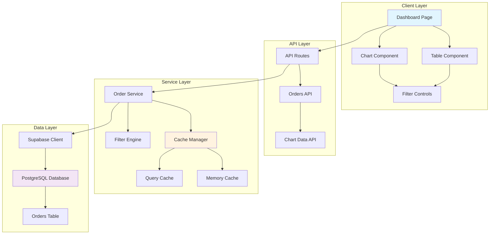

# Design Document

## Overview

This design outlines the migration of static order data from local files to a Supabase PostgreSQL database, implementing efficient data fetching with comprehensive filtering capabilities and intelligent caching mechanisms. The solution leverages Next.js App Router with server-side rendering, API routes, and client-side state management to provide optimal performance for both tabular data display and chart visualizations.

## Architecture

### High-Level Architecture



### Data Flow Architecture

1. **Client Request**: Dashboard components request data through API routes
2. **Cache Check**: Service layer checks cache for existing data
3. **Database Query**: If cache miss, query Supabase with optimized filters
4. **Data Processing**: Transform and aggregate data based on request type
5. **Cache Storage**: Store results in appropriate cache layer
6. **Response**: Return processed data to client components

## Components and Interfaces

### Database Schema

```sql
-- Orders table structure
CREATE TABLE orders (
    id TEXT PRIMARY KEY,
    customer TEXT NOT NULL,
    category TEXT NOT NULL,
    date DATE NOT NULL,
    source TEXT NOT NULL CHECK (source IN ('Online', 'In-Store', 'App', 'Phone')),
    geo TEXT NOT NULL,
    created_at TIMESTAMP WITH TIME ZONE DEFAULT NOW(),
    updated_at TIMESTAMP WITH TIME ZONE DEFAULT NOW()
);

-- Indexes for performance optimization
CREATE INDEX idx_orders_date ON orders(date);
CREATE INDEX idx_orders_category ON orders(category);
CREATE INDEX idx_orders_source ON orders(source);
CREATE INDEX idx_orders_geo ON orders(geo);
CREATE INDEX idx_orders_composite ON orders(date, category, source);
```

### API Endpoints

#### Orders API (`/api/orders`)
```typescript
interface OrdersAPIRequest {
  filters?: {
    categories?: string[];
    sources?: string[];
    dateRange?: {
      start: string;
      end: string;
    };
    geo?: string[];
  };
  pagination?: {
    page: number;
    limit: number;
  };
  sortBy?: string;
  sortOrder?: 'asc' | 'desc';
}

interface OrdersAPIResponse {
  data: Order[];
  pagination: {
    total: number;
    page: number;
    limit: number;
    totalPages: number;
  };
  cacheInfo: {
    cached: boolean;
    cacheKey: string;
    expiresAt: string;
  };
}
```

#### Chart Data API (`/api/orders/chart`)
```typescript
interface ChartDataRequest {
  type: 'category' | 'source' | 'geo' | 'timeline';
  filters?: OrderFilters;
  aggregation?: 'count' | 'sum' | 'avg';
  groupBy?: 'day' | 'week' | 'month';
}

interface ChartDataResponse {
  data: ChartDataPoint[];
  metadata: {
    total: number;
    aggregationType: string;
    timeRange: string;
  };
  cacheInfo: CacheInfo;
}
```

### Service Layer Components

#### Order Service
```typescript
class OrderService {
  private cacheManager: CacheManager;
  private supabase: SupabaseClient;
  
  async getOrders(request: OrdersAPIRequest): Promise<OrdersAPIResponse>;
  async getChartData(request: ChartDataRequest): Promise<ChartDataResponse>;
  private buildQuery(filters: OrderFilters): PostgrestFilterBuilder;
  private validateFilters(filters: OrderFilters): boolean;
}
```

#### Cache Manager
```typescript
class CacheManager {
  private memoryCache: Map<string, CacheEntry>;
  private readonly CACHE_TTL = 5 * 60 * 1000; // 5 minutes
  private readonly MAX_CACHE_SIZE = 100;
  
  get<T>(key: string): T | null;
  set<T>(key: string, value: T, ttl?: number): void;
  invalidate(pattern: string): void;
  generateKey(request: any): string;
  cleanup(): void;
}
```

#### Filter Engine
```typescript
class FilterEngine {
  static buildSupabaseQuery(
    query: PostgrestFilterBuilder,
    filters: OrderFilters
  ): PostgrestFilterBuilder;
  
  static validateDateRange(start: string, end: string): boolean;
  static sanitizeFilters(filters: OrderFilters): OrderFilters;
}
```

### Client Components

#### Filter State Management
```typescript
interface FilterState {
  categories: string[];
  sources: string[];
  dateRange: {
    start: string | null;
    end: string | null;
  };
  geo: string[];
}

const useOrderFilters = () => {
  const [filters, setFilters] = useState<FilterState>(initialFilters);
  const [isLoading, setIsLoading] = useState(false);
  
  const updateFilters = useCallback((newFilters: Partial<FilterState>) => {
    setFilters(prev => ({ ...prev, ...newFilters }));
  }, []);
  
  return { filters, updateFilters, isLoading, setIsLoading };
};
```

## Data Models

### Core Data Types

```typescript
interface Order {
  id: string;
  customer: string;
  category: string;
  date: string; // ISO date format
  source: 'Online' | 'In-Store' | 'App' | 'Phone';
  geo: string;
}

interface OrderFilters {
  categories?: string[];
  sources?: string[];
  dateRange?: {
    start: string;
    end: string;
  };
  geo?: string[];
}

interface ChartDataPoint {
  label: string;
  value: number;
  percentage?: number;
  metadata?: Record<string, any>;
}

interface CacheEntry<T = any> {
  data: T;
  timestamp: number;
  ttl: number;
  key: string;
}
```

### Migration Data Structure

```typescript
interface MigrationResult {
  success: boolean;
  migratedCount: number;
  errors: string[];
  duration: number;
  timestamp: string;
}
```

## Error Handling

### Error Types and Responses

```typescript
enum ErrorCode {
  VALIDATION_ERROR = 'VALIDATION_ERROR',
  DATABASE_ERROR = 'DATABASE_ERROR',
  CACHE_ERROR = 'CACHE_ERROR',
  NETWORK_ERROR = 'NETWORK_ERROR',
  RATE_LIMIT_ERROR = 'RATE_LIMIT_ERROR'
}

interface APIError {
  code: ErrorCode;
  message: string;
  details?: any;
  timestamp: string;
  requestId: string;
}
```

### Error Handling Strategy

1. **Client-Side Error Boundaries**: React error boundaries to catch and display user-friendly error messages
2. **API Error Responses**: Standardized error format with appropriate HTTP status codes
3. **Retry Logic**: Exponential backoff for transient failures
4. **Fallback Mechanisms**: Graceful degradation when cache or database is unavailable
5. **Logging**: Comprehensive error logging for debugging and monitoring

### Database Connection Resilience

```typescript
class DatabaseManager {
  private retryAttempts = 3;
  private retryDelay = 1000;
  
  async executeWithRetry<T>(
    operation: () => Promise<T>,
    context: string
  ): Promise<T> {
    for (let attempt = 1; attempt <= this.retryAttempts; attempt++) {
      try {
        return await operation();
      } catch (error) {
        if (attempt === this.retryAttempts) throw error;
        await this.delay(this.retryDelay * Math.pow(2, attempt - 1));
      }
    }
  }
}
```

## Testing Strategy

### Unit Testing
- **Service Layer**: Test order service methods, cache manager, and filter engine
- **Utility Functions**: Test data transformation and validation functions
- **API Routes**: Test endpoint logic with mocked database calls

### Integration Testing
- **Database Operations**: Test Supabase queries with test database
- **Cache Integration**: Test cache behavior with real cache implementation
- **API Endpoints**: Test full request/response cycle

### Performance Testing
- **Load Testing**: Test API endpoints under concurrent requests
- **Cache Performance**: Measure cache hit rates and response times
- **Database Query Performance**: Analyze query execution plans and optimize indexes

### End-to-End Testing
- **Filter Synchronization**: Test bidirectional filtering between table and chart
- **Data Migration**: Test complete migration process with validation
- **User Workflows**: Test complete user journeys through the dashboard

## Performance Optimizations

### Database Optimizations
1. **Composite Indexes**: Multi-column indexes for common filter combinations
2. **Query Optimization**: Use EXPLAIN ANALYZE to optimize query performance
3. **Connection Pooling**: Efficient database connection management
4. **Row Level Security**: Implement RLS policies for data security

### Caching Strategy
1. **Multi-Level Caching**: Memory cache for hot data, query cache for complex aggregations
2. **Cache Invalidation**: Smart invalidation based on data modification patterns
3. **Cache Warming**: Pre-populate cache with frequently accessed data
4. **Cache Compression**: Compress large cached datasets

### Client-Side Optimizations
1. **Data Virtualization**: Implement virtual scrolling for large datasets
2. **Debounced Filtering**: Prevent excessive API calls during filter changes
3. **Optimistic Updates**: Update UI immediately while background sync occurs
4. **Lazy Loading**: Load chart data only when components are visible

### API Optimizations
1. **Response Compression**: Enable gzip compression for API responses
2. **Pagination**: Implement cursor-based pagination for large datasets
3. **Field Selection**: Allow clients to specify required fields
4. **Batch Operations**: Support batch requests for multiple data types

## Security Considerations

### Data Protection
1. **Input Validation**: Comprehensive validation of all user inputs
2. **SQL Injection Prevention**: Use parameterized queries and Supabase's built-in protection
3. **Rate Limiting**: Implement rate limiting to prevent abuse
4. **CORS Configuration**: Proper CORS setup for API endpoints

### Authentication & Authorization
1. **Row Level Security**: Implement RLS policies if user-specific data is added
2. **API Key Management**: Secure handling of Supabase keys
3. **Environment Variables**: Proper management of sensitive configuration

## Migration Strategy

### Data Migration Process
1. **Pre-Migration Validation**: Validate existing data structure and integrity
2. **Schema Creation**: Create optimized database schema with indexes
3. **Data Transfer**: Batch insert with transaction management
4. **Post-Migration Verification**: Validate migrated data completeness and accuracy
5. **Rollback Plan**: Maintain ability to rollback to local data if needed

### Deployment Strategy
1. **Feature Flags**: Use feature flags to gradually roll out new functionality
2. **Blue-Green Deployment**: Maintain zero-downtime deployment capability
3. **Database Migrations**: Version-controlled database schema changes
4. **Monitoring**: Comprehensive monitoring of system performance and errors